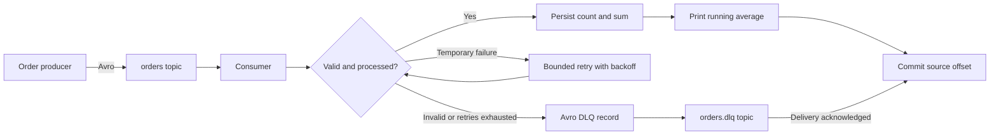

# Kafka Order Project

A Python implementation of the Chapter 3 assignment: publish Avro orders to Kafka, calculate a running average, retry temporary processing failures, and send failed orders to an Avro dead-letter queue.

## Assignment coverage

| Requirement | Implementation |
| --- | --- |
| Order schema | [`order.avsc`](orders/schemas/order.avsc): `orderId` string, `product` string, `price` float |
| Producer | Random product names and prices, unique order IDs, confirmed Kafka delivery |
| Consumer | Avro decoding and validation, manually committed offsets |
| Running average | Updated after every accepted order; SQLite persists count, sum, and replay receipts |
| Temporary failures | Three retries after the initial attempt, with exponential backoff |
| Permanent failures | Immediate DLQ routing; exhausted temporary failures also reach the DLQ |
| Live demonstration | `python -m orders demo` checks five deterministic scenarios against Kafka |
| Git submission | Source, comments, tests, setup instructions, and GitHub Actions |



## Setup

Use Python 3.11 or newer and Docker with Compose. Run commands from the repository root. Alternatively, run Kafka locally with Java as described below.

Windows PowerShell:

```powershell
python -m venv .venv
.\.venv\Scripts\python.exe -m pip install -r requirements-dev.txt
docker compose up -d --wait
.\.venv\Scripts\python.exe -m orders init
```

Linux/macOS:

```bash
python3 -m venv .venv
source .venv/bin/activate
python -m pip install -r requirements-dev.txt
docker compose up -d --wait
python -m orders init
```

The examples below use `python`; on Windows, substitute `.\.venv\Scripts\python.exe` if the virtual environment is not activated. Installing with `pip install -e .` also provides the `orders` command.

## Run the live demo

```bash
python -m orders demo
```

The demo creates fresh topics, a consumer group, and a state database for each run. It prints processing logs, checks the final result, and displays both decoded DLQ envelopes. A mismatch exits with a nonzero status.

| Order | Price | Demonstration | Expected result |
| --- | ---: | --- | --- |
| 1001 | 100 | Successful order | Count 1, average 100 |
| 1002 | 200 | Two temporary timeouts | Succeeds on attempt 3; count 2, average 150 |
| 1003 | -10 | Invalid price | DLQ immediately; average unchanged |
| 1004 | 400 | Persistent timeout | DLQ after 4 attempts; average unchanged |
| 1005 | 300 | Successful order | Count 3, average 200 |

The final summary must show `status: PASS`, `accepted: 3`, `dlq: 2`, `count: 3`, `total: 600.0`, and `average: 200.0`. See the [presentation walkthrough](docs/demo.md) for a suggested live explanation.

A completed local run is saved in [demo-result.json](docs/demo-result.json), with [processing logs](docs/demo-run.txt) and [verification details](docs/verification.md).

## Stream randomized orders

Start the consumer in one terminal:

```bash
python -m orders consume
```

Start the producer in another:

```bash
python -m orders produce --count 20 --interval 1 --seed 42
```

Each accepted order prints its price, count, and updated average. Stop the consumer with Ctrl+C. Restarting with the same group and database preserves the aggregate and continues from committed offsets.

Inspect failed orders:

```bash
python -m orders dlq
```

The DLQ viewer uses a new inspection group by default, reads from the beginning, and exits after 10 seconds without a message. Binary original values and keys are displayed as base64. The regular random producer emits valid orders; use `demo` to exercise failure paths.

Useful options:

```bash
python -m orders --bootstrap localhost:9092 consume --max-messages 20 --idle-timeout 30
python -m orders consume --retries 3 --backoff 0.5
python -m orders --help
```

`--bootstrap` goes before the subcommand. `--max-messages 0` means unlimited; consumer `--idle-timeout 0` means keep waiting. `--demo-failures` explicitly enables the test-only `demo-failures` header; ordinary consumers ignore it.

## Run Kafka on Windows without Docker

Install Java 17 or newer. Download the **Kafka 4.1.2 Scala 2.13 binary distribution** from [Apache](https://archive.apache.org/dist/kafka/4.1.2/) and verify its SHA-512 checksum against the accompanying `.sha512` file. Extract it, then run:

```powershell
powershell -ExecutionPolicy Bypass -File scripts/start-kafka.ps1 -KafkaHome 'C:\path\to\kafka_2.13-4.1.2'
```

The script formats new KRaft storage on first use, starts a single local broker, and retains data under `data/kafka`. Keep that terminal open while using the Python commands in a second terminal. Press Ctrl+C to stop Kafka. Do not run this broker and the Compose broker at the same time: both use port 9092.

For the prepared assignment workspace, the verified Kafka download is already under `tmp/kafka/kafka_2.13-4.1.2`, so the script works without `-KafkaHome`. Downloaded binaries and runtime data are intentionally excluded from Git.

## Tests

Unit tests need no broker:

```bash
python -m pytest -m "not integration" -q
```

With Kafka running, enable the integration tests:

```powershell
$env:KAFKA_INTEGRATION = '1'
.\.venv\Scripts\python.exe -m pytest -q
```

```bash
KAFKA_INTEGRATION=1 python -m pytest -q
```

Set `KAFKA_BOOTSTRAP` for a broker other than `localhost:9092`. Integration tests use unique topic names. GitHub Actions runs unit tests and real Kafka integration tests through Compose.

## Design notes and limits

- Avro values use the checked-in schemas directly with `fastavro`. A Schema Registry is not required for this fixed-schema assignment; these payloads do not use Confluent's schema-ID wire framing. See the [design explanation](docs/design.md).
- The aggregate is `sum of accepted prices / accepted count`. Invalid orders and exhausted retries never enter it. Price remains the assignment's 32-bit Avro `float`, so decimal values have binary rounding error; display formatting uses two decimal places.
- SQLite atomically stores each Kafka source position and the updated aggregate. This prevents counting a replayed position twice after a crash. It does not deduplicate a newly published order at a different offset based on `orderId`.
- Processing is at least once. A crash after DLQ acknowledgement but before source offset commit can duplicate a DLQ entry. The DLQ key is `topic:partition:offset`, allowing downstream deduplication. No end-to-end exactly-once claim is made.
- Use one consumer instance with one persistent state file for the global average. Separate state files across several consumers give separate averages. Never delete the database while keeping the group's committed offsets if you need a lifetime average. If you delete/recreate a topic, use a fresh group and database, because source offsets restart.
- Retry sleeps block this small sequential consumer to preserve ordering. Sleeps are capped at 5 seconds, with at most 10 retries. Unexpected infrastructure errors stop consumption without acknowledging the current input; they are not treated as permanently invalid orders.
- This is a local teaching setup: one broker, one partition per project topic, replication factor 1, and loopback-only plaintext access. A production service needs replicated brokers, authentication, distributed aggregation, and state lifecycle management.

Stop the Compose broker while retaining its data:

```bash
docker compose down
```

Each demo/test leaves its isolated topics for inspection. `docker compose down -v` deletes this project's Kafka volume when a full reset is intended; use new application state and consumer groups after that reset.

## Project files

```text
orders/
  schemas/         Avro order and dead-letter definitions
  codec.py         Binary serialization
  processing.py    Validation, retry policy, and DLQ envelopes
  state.py         Persistent running average and replay receipts
  broker.py        Kafka publishing, consumption, and offset commits
  cli.py           Producer, consumer, inspector, and verified demo
tests/             Unit and real-broker integration tests
scripts/           Native Windows Kafka launcher
docs/              Design and live demonstration notes
compose.yaml       Single-node Kafka in KRaft mode
```

## References

- [Apache Kafka quick start](https://kafka.apache.org/41/getting-started/quickstart/)
- [Apache Kafka Docker image configuration](https://hub.docker.com/r/apache/kafka)
- [Confluent Python client: delivery callbacks and manual commits](https://docs.confluent.io/kafka-clients/python/current/overview.html)
- [fastavro writer API](https://fastavro.readthedocs.io/en/latest/writer.html)
- [Apache Avro specification](https://avro.apache.org/docs/1.12.0/specification/)
